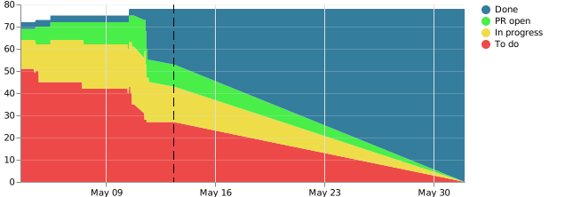

# Burndown for GitHub Projects



Burndown for GitHub Projects provides a [burndown chart](https://en.wikipedia.org/wiki/Burn_down_chart) for point-based agile sprints tracked using [Github Projects](https://github.com/features/project-management/). It simplifies identifying velocity, improves mid-sprint awareness, and allows a team to visualize how their workload evolves throughout a sprint.

## Table of Contents

- [Usage](#usage)
- [Configuring the Service](#configuring-the-service)
- [Using the Burndown Chart](#using-the-burndown-chart)
- [Contributing](#contributing)

## Usage

The application comes ready-to-go with a docker image. Create a file of environment entries (reference [the `.env.sample` file](./.env.sample) or [Configuring the Service](#configuring-the-service) for more details), build the docker image, and run it.

> :information_source: Don't have `npm` installed? See the [Docker-Only Implementation](#docker-only-implementation) guide.

```bash
# Create environment file
cp .env.sample .env

# Edit environment file
code .env --wait # Or your editor of choice

# Build docker image
# If using a different port than 8080, see the Docker-Only Implementation guide below
npm run docker:build

# Run docker image - Skip directly here after first run
npm run docker:run
```

### Docker-Only Implementation

<details>
<summary>Click to Expand</summary>

```bash
# Create environment file
cp .env.sample .env

# Edit environment file
code .env --wait # Or your editor of choice

# Build docker image
docker build . -t burndown-for-github-projects

# Run docker image - Skip directly here after first run
# Arguments:
# --env-file: apply environment to container
# -v: Give the docker image access to the ./data directory
# -it: run interactively (not in background)
# -p: give docker container access to a network port
# burndown-for-github-projects: run image created by `docker build` above
docker run \
  --env-file .env \
  -v $PWD/data:/app/data \
  -it \
  -p 8080:8080 \
  burndown-for-github-projects
```

</details>

## Configuring the Service

### Persistence Modes

Aggregate sprint data needs to be persisted across a time series in order to render the burndown chart. burndown-for-github-projects supports two modes to accomplish this today:

- Filesystem
- MongoDB

### Filesystem

By default, burndown-for-github-projects runs with local filesystem persistence. Data gathering will write JSON files specific for each project to a `/data` directory at the root of the project.

Define a volume at `$PWD/data` in order to write from docker. For example:

Command Line:

```
docker run --env-file .env -v $PWD/data:/app/data -it -p 8080:8080 <image_name>
```

### MongoDB

A `.burndownrc.js` file can be supplied at the root of the project. As of right now, it's primary use case is to configure a MongoDB configuration.

Here's an example, which is further informed via [MongoDB Environment Variables](#dataplugintype-mongodb-variables) or suggested defaults:

<!-- CODEBLOCK_START
{
    "value": ".burndownrc-sample.js",
    "hideValue": true
}
-->
<!-- prettier-ignore -->
~~~~~~~~~~js
const env = require('dotenv')

env.config({
  override: true,
})

const {
  DB_AUTH_DB,
  DB_COLLECTION,
  DB_HOST,
  DB_NAME,
  DB_PASSWORD,
  DB_PORT,
  DB_USER,
  DB_REPLICASET,
} = process.env

module.exports = {
  dataPlugin: {
    type: 'MongoDB',
    config: {
      authenticationDatabase: DB_AUTH_DB,
      collection: DB_COLLECTION || 'sprints',
      host: DB_HOST,
      databaseName: DB_NAME || 'burndown',
      password: DB_PASSWORD,
      port: DB_PORT || 27017,
      user: DB_USER || 'burndown',
      replicaSet: DB_REPLICASET,
      // Alt - Pass connectionString directly:
      // connectionString: 'mongodb://.....',
    },
  },
}
~~~~~~~~~~

<!-- CODEBLOCK_END -->

Using burndown-for-github-projects with this configuration will persist to and retrieve sprint data from a mongo database instead of using the filesystem.

### Environment Variables

| Environment Variable               | Required | Default Value                                                                                       | Description                                                                                                                                                                                                                                                                                                                                                          |
| ---------------------------------- | -------- | --------------------------------------------------------------------------------------------------- | -------------------------------------------------------------------------------------------------------------------------------------------------------------------------------------------------------------------------------------------------------------------------------------------------------------------------------------------------------------------- |
| `GITHUB_DEFAULT_ORGANIZATION_NAME` | `true`   |                                                                                                     | This organization's first project be polled according to the `CRON_SCHEDULE` to populate burndown data.                                                                                                                                                                                                                                                              |
| `GITHUB_TOKEN`                     | `true`   |                                                                                                     | [Generate a new `GITHUB_TOKEN`](https://github.com/settings/tokens/new?description=burndown%20for%20github%20projects&scopes=repo,read:org) with these permissions: `repo`, `read:org`.<br><br>:warning: This token should at all times be kept [secret](https://www.youtube.com/watch?v=iThtELZvfPs). Avoid committing, sharing, or leaking this wherever possible. |
| `PORT`                             | `false`  | `8080`                                                                                              | Port the service will be served from.                                                                                                                                                                                                                                                                                                                                |
| `GITHUB_API_URL`                   | `false`  | `https://api.github.com`                                                                            | API endpoint for Github or your company's Github Enterprise instance.                                                                                                                                                                                                                                                                                                |
| `GITHUB_PROJECT_REGEX`             | `false`  | `Sprint \d+ - (?<end_date>\d+/\d+/\d+)`                                                             | The service will only aggregate points from projects with names matching this pattern. The pattern **MUST** contain an `end_date` named capture group.                                                                                                                                                                                                               |
| `CHART_DEFAULT_DIMENSIONS`         | `false`  | `500x200`                                                                                           | Default height and width of the emitted SVG.                                                                                                                                                                                                                                                                                                                         |
| `CRON_SCHEDULE`                    | `false`  | `0 6-18/2 * * 1-5`<br>[Every 2 hours, 6a-6p, Monday-Friday](https://crontab.guru/#0_6-18/2**___1-5) | Cron string for when burndown data is collected.                                                                                                                                                                                                                                                                                                                     |
| `CRON_TIMEZONE`                    | `false`  | `America/Chicago`<br>US Central Time                                                                | Timezone the `CRON_SCHEDULE` is based on. Reference the `TZ Database Name` column of [Wikipedia's List of tz database time zones](https://en.wikipedia.org/wiki/List_of_tz_database_time_zones) for exact syntax.                                                                                                                                                    |

### DataPlugin.Type MongoDB Variables

| Environment Variable | Required | Suggested Default Value (from [config](#mongodb)) | Description                                                        |
| -------------------- | -------- | ------------------------------------------------- | ------------------------------------------------------------------ |
| DB_AUTH_DB           | `false`  | `admin`                                           | The place to store the user information for the burndown database. |
| DB_COLLECTION        | `false`  | `sprints`                                         | Where to store the sprint data records.                            |
| DB_HOST              | `true`   |                                                   | The server address of the database.                                |
| DB_NAME              | `false`  | `burndown`                                        | The name of the database.                                          |
| DB_PASSWORD          | `true`   |                                                   | The password to authenticate to the database.                      |
| DB_PORT              | `false`  | `27017`                                           | The port to access the database on.                                |
| DB_USER              | `false`  | `burndown`                                        | The user to authenticate to the database with.                     |
| DB_REPLICASET        | `false`  | `rs0`                                             | The replica set group processes maintaining the dataset.           |

## Using the Burndown Chart

Before you can use the burndown chart, you'll need to populate data for the chart by creating a Github project populated with issues that use story point labels.

### Story Point Labeling

Story points are aggregated from labels applied to issues which have been added to the sprint project. The only requirement is that the label be only digits; the description and color can be anything you want. That said, here is our recommended label set:

| Label | Description   | Color     |                                 |
| ----- | ------------- | --------- | ------------------------------- |
| `1`   | `Story Point` | `#00ff00` |  |
| `2`   | `Story Point` | `#55ff00` |  |
| `3`   | `Story Point` | `#aaff00` |  |
| `5`   | `Story Point` | `#ffff00` |  |
| `8`   | `Story Point` | `#ffaa00` |  |
| `13`  | `Story Point` | `#ff5500` |  |
| `21`  | `Story Point` | `#ff0000` |  |

### Project Setup

Sprints must be tracked as an organization-level project in Github (as opposed to a project within a specific repository). By default, data is only read from projects with a name matching `Sprint # - #/#/#`. This can be modified [with configuration](#configuring-the-service).

### `/burndown`

Fetch the burndown chart by navigating to http://localhost:8080/burndown (or your deployed server/port) in your browser. If it's running there, it might show up here:


This chart can be added to markdown or HTML documents:

```md

```

```html

```

The burndown chart works by aggregating story points across the different stages (columns) of a Github project. Story points are applied to work items via an [issue label](#story-point-labeling). All points for a given column are added up and applied to an area on the graph. These areas are stacked, with the farthest left column at the bottom and the farthest right at the top. This data is re-retrieved periodically over the course of a sprint. :warning: Burndown data can **NOT** currently be applied retroactively. While this service is offline, no data is collected.

### `/sprint`

Additionally, aggregate point data can be accessed at the `/sprint` endpoint:

```http
GET http://localhost:8080/sprint HTTP/1.1
```

By default, the lowest-numbered currently open project which [satisfies the project name regex](#project-setup) will be returned. To return a specific sprint instead, append the project number. The project must still be open and satisfy the regex in order to be returned.

```http
GET http://localhost:8080/sprint/123 HTTP/1.1
```

This data can be captured for sprints outside of the default organization by adding the `organization_name` query parameter:

```http
GET http://localhost:8080/sprint?organization-name=My-Other-Team HTTP/1.1

GET http://localhost:8080/sprint/123?organization-name=My-Other-Team HTTP/1.1
```

## Contributing

### Local Filesystem Development

After cloning the repository, install dependencies:

```bash
npm ci
```

During dependency installation, placeholder configurations are written to `.env`. Fill in any blank values, referencing [Configuring the Service](#configuring-the-service).

> Lose your `.env` file? You can copy [the `.env.sample` file](./.env.sample) to generate a new one.

Once the environment values are entered, the app is ready to run:

```bash
npm start
```

This application is built in TypeScript. Starting the app will...

1. Clear out any `build/` files from a previous run
1. Build the TypeScript files into plain JavaScript, re-building when any files are updated
1. Start the application server, re-starting each time new build files are emitted

### Local Docker Development

You can run the entire stack with a provided `docker-compose.yml` file. It comes pre-configured for the Mongo persistence mode.

Run `npm run start:db` to start the database and the app. It will inline the `.burndownrc-sample.js` file during startup.

### Validation

This app ships with a local suite of [jest](https://jestjs.io/) tests, [eslint](https://eslint.org/) + [prettier](https://prettier.io/) configurations for code consistency and formatting, and [TypeScript](https://www.typescriptlang.org/) type validation.

These checks run within a GitHub action. `npm run lint` runs during precommit.
